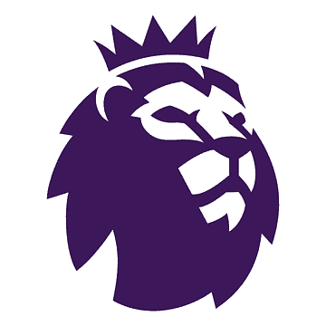

# Premier-League-Player-API
     

Eine RESTful API zur Verwaltung von Premier League-Spielerdaten

## 📌 Projektübersicht

* Abruf von Spielerdaten (Einzelspieler, ganze Teams)

* Transfer-Simulation zwischen Vereinen

* Hinzufügen/Entfernen von Spielern

* Datenbereitstellung im JSON-Format

## 🔍 Endpunkte

| Methode   | Endpoint                   | Beschreibung                          |
|-----------|----------------------------|---------------------------------------|
| `GET`     | `/api/players`             | Gibt alle Spieler zurück              |
| `GET`     | `/api/players/:name`       | Sucht Spieler nach Name               |
| `GET`     | `/api/:club`               | Zeigt alle Spieler eines Vereins      |
| `POST`    | `/api/players`             | Fügt neuen Spieler hinzu              |
| `PUT`     | `/api/transfer`            | Führt Spielertransfer durch           |
| `DELETE`  | `/api/players/:name`       | Entfernt einen Spieler                |

## Dataset
- [English Premier League - Player Stats - 24/25](https://www.kaggle.com/datasets/aesika/english-premier-league-player-stats-2425/data/)
